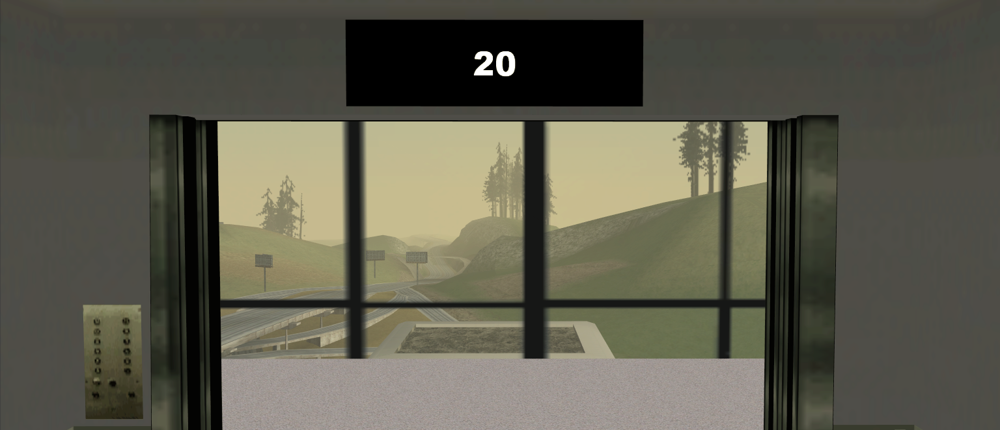

# Elevator Plus

Elevator Plus - a lightweight and feature-rich library for SA-MP to create elevator systems with digital displays and floor queues in minutes.



## Reference
* [Installation](#installation)
* [Example](#example)
* [Functions](#functions)
* [Callbacks](#callbacks)
* [Definition](#definition)

## Installation

Include in your code and begin using the library:
```pawn
#include <elevator-plus>
```

## Example

```pawn
public OnGameModeInit() {

    // Create an elevator
    CreateElevator("ls_beach_building", 287.942504, -1609.334838, 33.827411, 0.0, 0.0, 80.0);

    // Create a floor
    CreateElevatorFloor("ls_beach_building", 284.8362,-1611.4973,17.8593, 0.0);
    CreateElevatorFloor("ls_beach_building", 284.8362,-1611.4973,32.9621, 0.0);
    CreateElevatorFloor("ls_beach_building", 284.8362,-1611.4973,47.0014, 0.0);
    CreateElevatorFloor("ls_beach_building", 284.8362,-1611.4973,51.5025, 0.0);
    CreateElevatorFloor("ls_beach_building", 284.8362,-1611.4973,56.0036, 0.0);
    CreateElevatorFloor("ls_beach_building", 284.8362,-1611.4973,60.5047, 0.0);
    CreateElevatorFloor("ls_beach_building", 284.8362,-1611.4973,65.0058, 0.0);
    CreateElevatorFloor("ls_beach_building", 284.8362,-1611.4973,69.5069, 0.0);
    CreateElevatorFloor("ls_beach_building", 284.8362,-1611.4973,73.9923, 0.0);
    CreateElevatorFloor("ls_beach_building", 284.8362,-1611.4973,78.4934, 0.0);
    CreateElevatorFloor("ls_beach_building", 284.8362,-1611.4973,82.9945, 0.0);
    CreateElevatorFloor("ls_beach_building", 284.8362,-1611.4973,87.4956, 0.0);
    CreateElevatorFloor("ls_beach_building", 284.8362,-1611.4973,91.9967, 0.0);
    CreateElevatorFloor("ls_beach_building", 284.8362,-1611.4973,96.4978, 0.0);

    // Move the elevator to a floor
    SetElevatorFloor("ls_beach_building", 1);

    return 1;
}
```
## Functions
<details>
<summary>Click to expand the list</summary>

#### CreateElevator(const elevatorName[], Float:x, Float:y, Float:z, Float:rx, Float:ry, Float:rz, worldid = -1, interiorid = -1)
> Create an elevator
> * `elevatorName[]` - Elevator name
> * `Float:x` - The x coordinate to create the object
> * `Float:y` - The y coordinate to create the object
> * `Float:z` - The z coordinate to create the object
> * `Float:rx` - The rx rotation of the object
> * `Float:ry` - The ry rotation of the object
> * `Float:rz` - The rz rotation of the object
> * `worldid` - The virtual world ID
> * `interiorid` - The interior ID

#### CreateElevatorFloor(const elevatorName[], Float:x, Float:y, Float:z, Float:z_offset = 0.0, const dialogText[] = "", const displayText[] = "")
> Adds a floor to an elevator, including a call button and floor doors.
> * `elevatorName[]` - Elevator name
> * `Float:x` - The x coordinate
> * `Float:y` - The y coordinate
> * `Float:z` - The z coordinate
> * `Float:z_offset` - Z offset for the floor
> * `dialogText[]` - Name in the list of floors
> * `displayText[]` - Displays the floor number

#### SetElevatorFloor(const elevatorName[], floor)
> Move the elevator to a floor
> * `elevatorName[]` - Elevator name
> * `floor` - Floor number

#### GetElevatorCabinObjectID(const elevatorName[], &cabinID, &leftDoorID, &rightDoorID, &displayID)
> Get the elevator object id
> * `elevatorName[]` - Elevator name
> * `&cabinID` - Elevator cab id
> * `&leftDoorID` - Left door id
> * `&rightDoorID` - Right door id
> * `&displayID` - Digital display id
> * `Note` - **CreateObject is used**

#### GetElevatorFloorDoorID(const elevatorName[], floor, &leftDoorID, &rightDoorID)
> Get the ID of the floor doors object
> * `elevatorName[]` - Elevator name
> * `floor` - Floor number
> * `&leftDoorID` - Left door id
> * `&rightDoorID` - Right door id
> * `Note` - **CreateDynamicObject is used**
</details>

## Callbacks
<details>
<summary>Click to expand the list</summary>

#### public OnElevatorMoveToFloor(const elevatorName[], oldFloor, newFloor)
> Triggered when the elevator starts moving towards a destination floor. 
> * `elevatorName[]` - Elevator name
> * `oldFloor` - Old floor
> * `newFloor` - New floor

#### public OnElevatorArrivedFloor(const elevatorName[], floor)
> Triggered when the elevator finishes moving and arrives at the floor.
> * `elevatorName[]` - Elevator name
> * `floor` - Floor number
</details>

## Definition
<details>
<summary>Click to expand the list</summary>

```pawn
#define ELEVATOR_MAX_ELEVATORS 10
#define ELEVATOR_MAX_FLOORS 30
#define ELEVATOR_NAME_LENGTH 32
#define ELEVATOR_DOOR_SPEED 3.0 // movement speed of the doors
#define ELEVATOR_CABIN_SPEED 3.0 // movement speed of the elevator
#define ELEVATOR_TIMER_INTERVAL 500 
#define ELEVATOR_DOOR_CLOSE_DELAY 8000 // milliseconds
#define ELEVATOR_OBJECT_DISTANCE 100.0
#define ELEVATOR_DISABLE_DISPLAY
#define ELEVATOR_DIALOG_ID 27303
#define ELEVATOR_CHAT_MESSAGE_COLOR 0xFFFFFFAA

new const ELEVATOR_TEXT_CABIN[] = "{CCCCCC}~k~~SNEAK_ABOUT~";
new const ELEVATOR_TEXT_FLOOR_CALL[] = "Call the elevator\n{CCCCCC}~k~~SNEAK_ABOUT~{FFFFFF}";
new const ELEVATOR_TEXT_FLOOR_DIALOG[] = "Floor %d";
new const ELEVATOR_TEXT_COMING[] = "{AFAFAF}Already coming to you";
new const ELEVATOR_TEXT_QUEUED[] = "{AFAFAF}The floor is already in the queue";
new const ELEVATOR_TEXT_CALLED[] = "Elevator called";
new const ELEVATOR_TEXT_FLOOR_COLOR[] = "{65cd38}";
new const ELEVATOR_DIALOG_TITLE[] = "Select floor";
new const ELEVATOR_DIALOG_BUTTON1[] = "Select";
new const ELEVATOR_DIALOG_BUTTON2[] = "Close";
```
</details>
